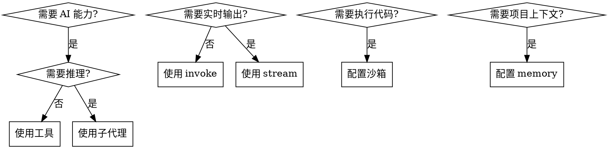

# Using DeepAgents

## Overview

DeepAgents 是一个基于 LangChain 的 AI 代理框架，支持工具、子代理、流式响应、中间件和沙箱执行。核心原则：**先简单后复杂，最小化实现优先**。

## 响应原则（重要）

### 最小化优先

**压力场景下（时间紧、快速演示）**：
- ✅ 先给最简单的可工作代码
- ✅ 一个清晰的示例胜过多个复杂示例
- ❌ 不要创建额外的文档文件
- ❌ 不要提供多个版本供选择
- ❌ 不要为了"完整性"添加额外内容

**何时创建文件**：
- ❌ 不要：为了"完整性"创建指南文档
- ❌ 不要：创建多个版本供用户选择
- ✅ 可以：用户明确要求创建文件
- ✅ 可以：需要可运行的示例代码（单个文件）

### 红旗 - 停下来检查

这些想法意味着你违反了最小化原则：

- "让我创建一个完整的指南文档"
- "我会提供多个版本供选择"
- "为了完整性，我还会创建..."
- "让我添加一些额外的示例"
- "我会创建一个 README 来说明..."

**所有这些都意味着：停止，回到最简单的方案。**

### 环境变量优先提醒

**每个代码示例前必须提醒**：

```bash
# ⚠️ 必须先设置
export ANTHROPIC_API_KEY="your-key"
```

没有设置会导致：`Error: ANTHROPIC_API_KEY not found`

## 快速参考

### 基础代理创建

```bash
# ⚠️ 必须先设置环境变量
export ANTHROPIC_API_KEY="your-key"
```

```typescript
import { createDeepAgent } from "deepagents";
import { ChatAnthropic } from "@langchain/anthropic";

const agent = createDeepAgent({
  model: new ChatAnthropic({ 
    model: "claude-sonnet-4-20250514" 
  }),
  systemPrompt: "你是一个有帮助的助手",
});

// 调用
const result = await agent.invoke({
  messages: [{ role: "user", content: "你好" }],
}, { recursionLimit: 50 });
```

### 工具 vs 子代理决策

| 场景 | 使用 |
|------|------|
| 简单查询（天气、搜索） | 工具 |
| 需要推理的复杂任务 | 子代理 |
| API 调用、计算 | 工具 |
| 多步骤研究、分析 | 子代理 |

### 流式响应

```typescript
// 基础流式
for await (const [namespace, chunk] of await agent.stream(
  { messages: [{ role: "user", content: "问题" }] },
  { streamMode: "messages", subgraphs: true }
)) {
  const [message] = chunk;
  if (message.text) {
    process.stdout.write(message.text);
  }
}
```

## 核心概念

### 1. 创建代理

**最小化实现**（优先使用）：

```typescript
const agent = createDeepAgent({
  model: new ChatAnthropic({ model: "claude-sonnet-4-20250514" }),
  systemPrompt: "你的系统提示",
});
```

**完整配置**：

```typescript
const agent = createDeepAgent({
  model: new ChatAnthropic({ 
    model: "claude-sonnet-4-20250514",
    temperature: 0.7,
  }),
  systemPrompt: "系统提示",
  tools: [tool1, tool2],           // 可选
  subagents: [subagent1],          // 可选
  middleware: [logger],            // 可选
  memory: ["./AGENTS.md"],         // 可选
  backend: filesystemBackend,      // 可选
});
```

**关键参数**：
- `recursionLimit`: 默认 25，复杂任务建议 50-100
- 环境变量：`ANTHROPIC_API_KEY` 必须设置

### 2. 添加工具

使用 `tool` 函数创建：

```typescript
import { tool } from "langchain";
import { z } from "zod";

const searchTool = tool(
  async ({ query }: { query: string }) => {
    // 实现搜索逻辑
    return `搜索结果：${query}`;
  },
  {
    name: "search_web",
    description: "搜索网络信息", // 重要：清晰描述用途
    schema: z.object({
      query: z.string().describe("搜索查询"),
    }),
  }
);

const agent = createDeepAgent({
  model: new ChatAnthropic({ model: "claude-sonnet-4-20250514" }),
  systemPrompt: "你可以使用 search_web 工具搜索信息",
  tools: [searchTool],
});
```

**工具最佳实践**：
- `description` 要清晰说明何时使用
- 参数使用 Zod schema 验证
- 保持工具功能单一

### 3. 添加子代理

```typescript
import type { SubAgent } from "deepagents";

const researcherSubAgent: SubAgent = {
  name: "researcher",
  description: "深入研究复杂主题，进行多次搜索并生成报告", // 关键：说明何时使用
  systemPrompt: "你是专业研究员。使用搜索工具收集信息，然后生成详细报告。",
  tools: [searchTool], // 子代理可以有自己的工具
};

const agent = createDeepAgent({
  model: new ChatAnthropic({ model: "claude-sonnet-4-20250514" }),
  systemPrompt: "你是协调员。简单查询用工具，复杂研究委托给 researcher 子代理。",
  tools: [searchTool],
  subagents: [researcherSubAgent],
});
```

**子代理最佳实践**：
- `description` 必须清晰说明使用场景
- `systemPrompt` 说明子代理的职责和工作方式
- 在主代理的 `systemPrompt` 中说明何时委托给子代理

### 4. 流式响应

**streamMode 选择**：

| streamMode | 用途 | 返回内容 |
|------------|------|----------|
| `"messages"` | 实时文本输出 | LLM 生成的 token |
| `"updates"` | 进度跟踪 | 图节点状态更新 |
| `"custom"` | 自定义事件 | 通过 writer 发送的事件 |

**基础实现**（仅主代理）：

```typescript
for await (const [namespace, chunk] of await agent.stream(
  { messages: [{ role: "user", content: "问题" }] },
  { streamMode: "messages", subgraphs: false }
)) {
  const [message] = chunk;
  if (message.text) {
    process.stdout.write(message.text);
  }
}
```

**包含子代理**：

```typescript
for await (const [namespace, chunk] of await agent.stream(
  { messages: [{ role: "user", content: "问题" }] },
  { streamMode: "messages", subgraphs: true } // 启用子图
)) {
  const [message] = chunk;
  
  // 判断来源
  const isSubagent = namespace.some((s: string) => s.startsWith("tools:"));
  const source = isSubagent ? "子代理" : "主代理";
  
  if (message.text) {
    console.log(`[${source}] ${message.text}`);
  }
}
```

**重要**：模型配置必须设置 `streaming: true`

### 5. 中间件

使用 `createMiddleware` 创建：

```typescript
import { createMiddleware } from "langchain";

const logger = createMiddleware({
  name: "log",
  wrapModelCall: async (request, handler) => {
    const result = await handler(request);
    console.log("AI 返回:", result.content);
    return result;
  },
  wrapToolCall: async (request, handler) => {
    const result = await handler(request);
    console.log("工具返回:", result.content);
    return result;
  },
});

const agent = createDeepAgent({
  model: new ChatAnthropic({ model: "claude-sonnet-4-20250514" }),
  systemPrompt: "你是助手",
  middleware: [logger],
});
```

**可用钩子**：
- `wrapModelCall` - 拦截 LLM 调用
- `wrapToolCall` - 拦截工具调用
- `beforeAgent` - 代理执行前
- `beforeModel` - 模型调用前

### 6. 内存（Memory）

从 AGENTS.md 文件加载项目上下文：

```typescript
import { FilesystemBackend } from "deepagents";
import path from "node:path";

const backend = new FilesystemBackend({
  rootDir: process.cwd(),
});

const agent = createDeepAgent({
  model: new ChatAnthropic({ model: "claude-sonnet-4-20250514" }),
  systemPrompt: "你是编程助手。参考从 AGENTS.md 加载的项目上下文。",
  backend,
  memory: [
    path.join(process.cwd(), "AGENTS.md"),
    // 可以加载多个文件
  ],
});
```

**注意**：
- `memory` 在代理启动时加载一次
- 需要 `FilesystemBackend` 才能读取文件
- 多个文件按顺序合并

### 7. 沙箱执行

扩展 `BaseSandbox` 实现隔离执行：

```typescript
import { BaseSandbox, type ExecuteResponse } from "deepagents";
import cp from "node:child_process";
import fs from "node:fs";
import path from "node:path";

class LocalShellSandbox extends BaseSandbox {
  readonly id: string;
  private readonly workingDirectory: string;
  private readonly timeout: number;

  constructor(options: { workingDirectory: string; timeout?: number }) {
    super();
    this.workingDirectory = path.resolve(options.workingDirectory);
    this.timeout = options.timeout ?? 30000;
    this.id = `local-shell-${Date.now()}`;
    
    if (!fs.existsSync(this.workingDirectory)) {
      fs.mkdirSync(this.workingDirectory, { recursive: true });
    }
  }

  async execute(command: string): Promise<ExecuteResponse> {
    return new Promise((resolve) => {
      const chunks: string[] = [];
      
      const child = cp.spawn("/bin/bash", ["-c", command], {
        cwd: this.workingDirectory,
      });

      child.stdout.on("data", (data) => chunks.push(data.toString()));
      child.stderr.on("data", (data) => chunks.push(data.toString()));

      const timer = setTimeout(() => {
        child.kill("SIGTERM");
        resolve({
          output: chunks.join("") + "\n[Timeout]",
          exitCode: null,
          truncated: false,
        });
      }, this.timeout);

      child.on("close", (exitCode) => {
        clearTimeout(timer);
        resolve({
          output: chunks.join(""),
          exitCode,
          truncated: false,
        });
      });
    });
  }

  async uploadFiles(files: Array<[string, Uint8Array]>) {
    return files.map(([filePath, content]) => {
      try {
        const fullPath = path.join(this.workingDirectory, filePath);
        fs.mkdirSync(path.dirname(fullPath), { recursive: true });
        fs.writeFileSync(fullPath, content);
        return { path: filePath, error: null };
      } catch {
        return { path: filePath, error: "invalid_path" as const };
      }
    });
  }

  async downloadFiles(paths: string[]) {
    return paths.map((filePath) => {
      try {
        const fullPath = path.join(this.workingDirectory, filePath);
        const content = fs.readFileSync(fullPath);
        return { path: filePath, content: new Uint8Array(content), error: null };
      } catch {
        return { path: filePath, content: null, error: "file_not_found" as const };
      }
    });
  }
}

// 使用
const sandbox = new LocalShellSandbox({ 
  workingDirectory: "./sandbox-workspace" 
});

const agent = createDeepAgent({
  model: new ChatAnthropic({ model: "claude-sonnet-4-20250514" }),
  systemPrompt: "你可以在沙箱中执行命令",
  backend: sandbox,
});
```

**必须实现的方法**：
- `execute(command)` - 执行命令
- `uploadFiles(files)` - 上传文件
- `downloadFiles(paths)` - 下载文件

**自动提供的工具**：
- `ls`, `read_file`, `write_file`, `edit_file`, `grep`, `glob`

**跨平台注意**：
- Windows: 使用 `cmd.exe` 或 `powershell.exe` 替代 `/bin/bash`
- 或使用现成的沙箱：`@langchain/deno`, `@langchain/modal`

### 8. 层级代理

子代理可以是完整的 DeepAgent：

```typescript
import type { CompiledSubAgent } from "deepagents";

// 创建子代理（本身是 DeepAgent）
const researchAgent = createDeepAgent({
  systemPrompt: "你是研究专家",
  tools: [searchTool],
  subagents: [
    {
      name: "fact-checker",
      description: "验证事实",
      systemPrompt: "你是事实核查员",
      tools: [verifyTool],
    },
  ],
});

// 在主代理中使用
const mainAgent = createDeepAgent({
  systemPrompt: "你是协调员",
  tools: [weatherTool],
  subagents: [
    {
      name: "research-specialist",
      description: "专业研究代理，可以搜索和验证信息",
      runnable: researchAgent, // 使用 runnable 传递编译好的代理
    } satisfies CompiledSubAgent,
  ],
});
```

## 常见陷阱

### 1. 忘记设置环境变量（最常见）

```bash
# ⚠️ 必须设置，否则会报错
export ANTHROPIC_API_KEY="your-key"
```

**错误信息**：`Error: ANTHROPIC_API_KEY not found` 或 `401 Unauthorized`

### 2. recursionLimit 太小

```typescript
// ❌ 默认 25 可能不够
await agent.invoke({ messages }, { recursionLimit: 25 });

// ✅ 复杂任务使用更大值
await agent.invoke({ messages }, { recursionLimit: 50 });
```

### 3. 流式响应忘记启用 streaming

```typescript
// ❌ 忘记启用
model: new ChatAnthropic({ model: "claude-sonnet-4-20250514" })

// ✅ 必须启用
model: new ChatAnthropic({ 
  model: "claude-sonnet-4-20250514",
  streaming: true 
})
```

### 4. 子代理 description 不清晰

```typescript
// ❌ 太模糊
description: "研究代理"

// ✅ 清晰说明使用场景
description: "深入研究复杂主题，进行多次搜索并生成详细报告。用于需要多步骤推理的研究任务。"
```

### 5. Windows 沙箱兼容性

```typescript
// ❌ 仅 Linux/Mac
cp.spawn("/bin/bash", ["-c", command])

// ✅ 跨平台
const shell = process.platform === "win32" ? "cmd.exe" : "/bin/bash";
const args = process.platform === "win32" ? ["/c", command] : ["-c", command];
cp.spawn(shell, args)
```

## 实践检查清单

创建 deepagents 应用时检查：

- [ ] **环境变量已设置**（ANTHROPIC_API_KEY）- 最重要
- [ ] 选择了合适的模型
- [ ] systemPrompt 清晰说明代理职责
- [ ] 工具的 description 说明何时使用
- [ ] 子代理的 description 说明使用场景
- [ ] 设置了合适的 recursionLimit（默认 25，复杂任务 50+）
- [ ] 流式响应启用了 streaming: true
- [ ] 错误处理已实现
- [ ] 跨平台兼容性已考虑（如果使用沙箱）

## 合理化借口表格

识别这些借口意味着你可能过度工程化：

| 借口 | 现实 |
|------|------|
| "为了完整性，我还会创建..." | 用户只要求解决问题，不需要额外文档 |
| "我会提供多个版本供选择" | 一个清晰的示例就够了，多个版本增加混乱 |
| "让我创建一个详细的指南" | 用户在时间压力下，需要快速方案不是文档 |
| "基于项目中的模式" | 不要盲目复制，要根据用户需求最小化 |
| "代码简洁且功能完整" | 简洁不等于创建多个文件 |
| "非常适合快速演示" | 如果创建了多个文件，就不够快速 |

## 决策流程图



## 参考资源

- 官方示例：`examples/` 目录
- 研究代理：`examples/research/research-agent.ts`
- 层级代理：`examples/hierarchical/hierarchical-agent.ts`
- 沙箱示例：`examples/sandbox/local-sandbox.ts`
- 流式示例：`examples/streaming/`
