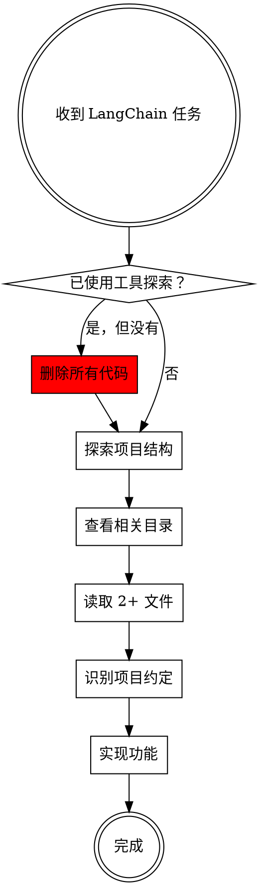

# Using LangChain.js

## Overview

LangChain.js 是一个用于构建 LLM 应用的框架。在实现 LangChain 功能前，必须先探索项目现有代码，理解已有模式，然后使用项目约定的工具和库。

## When to Use

使用此 skill 当：
- 实现 RAG（检索增强生成）
- 添加对话记忆功能
- 构建 Agent 或 Chain
- 使用 LangChain 的任何功能
- 集成向量数据库、Embeddings、工具等

## 核心原则

**探索优先于实现**：在写任何代码前，先理解项目已有的实现。

## 铁律

```
没有探索就没有实现
NO EXPLORATION = NO CODE
```

如果你没有使用工具查看项目现有代码，你写的任何代码都是无效的。

**违反后果**：删除所有代码，从探索步骤重新开始。

**无例外**：
- 不是"我知道项目用什么"
- 不是"这个很简单不需要看"
- 不是"探索浪费时间"
- 不是"用户很急"

**所有这些都意味着：停下来，使用工具探索项目。**

## 实现流程



**关键决策点**："已使用工具探索？"
- 如果你还没有使用 Glob/Bash 查看目录结构 → 必须先探索
- 如果你还没有使用 Read 读取至少 2 个相关文件 → 必须先读取
- 如果你已经写了代码但没有探索 → 删除代码，重新开始

### 1. 探索项目结构（强制步骤）

**必须使用工具**：在写任何代码前，必须使用 Glob 或 Bash 工具

```bash
# 查看主要目录
ls -la

# 查找相关文件
find . -name "*.ts" -o -name "*.tsx" | grep -E "(chain|memory|rag|agent)"
```

**验证**：你的响应中必须包含 Glob 或 Bash 工具调用的结果。如果没有，停止并执行此步骤。

### 2. 查看相关目录

根据任务类型，查看对应目录：

| 任务类型 | 查看目录 |
|---------|---------|
| RAG 实现 | `4.rag/`, `5.index/` |
| 对话记忆 | `3.记忆/` |
| Chain 链式调用 | `2.chain/` |
| Agent 代理 | `7.agent/` |
| 工具集成 | `6.tools/` |
| 模型使用 | `1.model/` |

### 3. 检查已有实现（强制步骤）

**必须使用 Read 工具**读取至少 2 个现有文件，了解：
- 使用了哪些 LangChain 包
- 如何配置 LLM
- 代码风格和命名约定
- 已有的模式和最佳实践

**验证**：你的响应中必须包含至少 2 次 Read 工具调用。如果没有，停止并执行此步骤。

**不要猜测**：
- ❌ "项目可能使用 DeepSeek" → 必须读取文件确认
- ❌ "通常使用数字命名" → 必须查看目录确认
- ✅ "我读取了 3.记忆/1.ts，发现使用 ChatDeepSeek" → 正确

### 4. 识别项目约定

从现有代码中识别：

**LLM 配置**：
```typescript
// 检查项目使用的 LLM
import { ChatDeepSeek } from '@langchain/deepseek'
// 或其他提供商

const llm = new ChatDeepSeek({
    model: process.env.DEEPSEEK_MODEL_ID,
    apiKey: process.env.DEEPSEEK_API_KEY,
});
```

**环境变量**：检查 `.env` 文件或现有代码中的环境变量

**命名约定**：
- 数字命名（1.ts, 2.ts）vs 描述性命名
- 目录结构
- 文件组织方式

### 5. 使用项目工具

**优先使用项目已配置的工具**：
- 如果项目使用 DeepSeek，不要切换到 OpenAI
- 如果项目使用 Redis，不要切换到文件存储
- 如果项目使用特定的 Embeddings 模型，保持一致

### 6. 参考现有模式

**复用而不是重写**：
- 如果项目已有类似实现，参考其模式
- 使用相同的导入路径
- 遵循相同的代码结构

## LangChain.js 核心概念

### Runnable 和 Chain

```typescript
// Chain 是可组合的
const chain = prompt.pipe(llm).pipe(parser);

// RunnableSequence 用于复杂流程
const chain = RunnableSequence.from([
  { context: retriever, question: (x) => x },
  prompt,
  llm,
  parser
]);
```

### Memory（记忆）

**内置方案优先**：

```typescript
// 使用 RunnableWithMessageHistory
import { RunnableWithMessageHistory } from '@langchain/core/runnables';

const chainWithHistory = new RunnableWithMessageHistory({
  runnable: chain,
  getMessageHistory: (sessionId) => {
    return new RedisChatMessageHistory({ client, sessionId });
  },
  inputMessagesKey: 'query',
  historyMessagesKey: 'history'
});
```

### RAG（检索增强生成）

**核心组件**：
1. **Document Loaders**：加载文档
2. **Text Splitters**：切分文档
3. **Embeddings**：向量化
4. **Vector Stores**：存储向量
5. **Retrievers**：检索相关文档

```typescript
// 标准 RAG 流程
const docs = await loader.load();
const splits = await splitter.splitDocuments(docs);
const vectorStore = await VectorStore.fromDocuments(splits, embeddings);
const retriever = vectorStore.asRetriever();

const chain = RunnableSequence.from([
  { context: retriever, question: (x) => x },
  prompt,
  llm,
  parser
]);
```

### Retrievers

**高级检索器**：
- `ParentDocumentRetriever`：父子文档检索
- `MultiQueryRetriever`：多查询检索
- `ContextualCompressionRetriever`：上下文压缩

**检索策略**：
- `similaritySearch`：相似度检索
- `maxMarginalRelevance`：最大边际相关性
- `similaritySearchWithScore`：带分数的检索

## 常见包导入

```typescript
// 核心包
import { ChatPromptTemplate } from "@langchain/core/prompts";
import { StringOutputParser } from "@langchain/core/output_parsers";
import { RunnableSequence } from "@langchain/core/runnables";

// 文档加载
import { TextLoader } from "@langchain/classic/document_loaders/fs/text";
import { DirectoryLoader } from "@langchain/classic/document_loaders/fs/directory";

// 文本切分
import { RecursiveCharacterTextSplitter } from "@langchain/textsplitters";

// 向量存储
import { MemoryVectorStore } from "@langchain/classic/vectorstores/memory";

// 记忆
import { RedisChatMessageHistory } from '@langchain/redis';
import { InMemoryChatMessageHistory } from '@langchain/core/chat_history';

// 工具
import { tool } from '@langchain/core/tools';
import { StructuredTool } from '@langchain/core/tools';
```

## 常见错误

| 错误 | 正确做法 |
|------|---------|
| 不查看现有代码就开始实现 | 先探索项目，理解已有模式 |
| 使用不同的 LLM 提供商 | 使用项目已配置的 LLM |
| 重新实现已有功能 | 复用现有代码或参考其模式 |
| 自定义实现内置功能 | 优先使用 LangChain 内置组件 |
| 忽略项目命名约定 | 遵循项目的文件命名和组织方式 |
| 创建不必要的文档文件 | 除非明确要求，否则不创建 README |

## 红旗警告 - 立即停止

这些想法意味着你在违反铁律：

| 借口 | 现实 |
|------|------|
| "我知道怎么做，不需要看现有代码" | 你不知道这个项目怎么做。必须探索。 |
| "用我熟悉的方式更快" | 用错误的方式更慢。探索节省时间。 |
| "自定义实现更灵活" | 不一致的实现难以维护。必须参考现有代码。 |
| "项目代码可能过时了" | 项目代码是当前标准。必须遵循。 |
| "这个功能很简单，直接实现就行" | 简单功能也需要一致性。必须探索。 |
| "用户很急，没时间探索" | 探索 5 分钟，节省 30 分钟返工。 |
| "我已经知道项目用什么" | 知道 ≠ 验证。必须使用工具确认。 |
| "探索是浪费时间" | 不探索导致重复工作才是浪费。 |

**所有这些都意味着：删除代码，使用工具探索项目。**

## 自我检查

在写任何代码前，问自己：

1. ✅ 我是否使用了 Glob/Bash 查看了项目结构？
2. ✅ 我是否使用了 Read 读取了至少 2 个相关文件？
3. ✅ 我是否确认了项目使用的 LLM 和配置？
4. ✅ 我是否了解了项目的命名约定？

如果任何一个答案是"否"，**停止编码，先完成探索**。

## 强制检查清单

### 阶段 1：探索（必须完成才能编码）

- [ ] **已使用 Glob/Bash 工具**查看项目目录结构
- [ ] **已使用 Read 工具**读取至少 2 个相关文件
- [ ] **已确认**项目使用的 LLM（通过读取文件，不是猜测）
- [ ] **已确认**项目的命名约定（通过查看目录，不是假设）
- [ ] **已检查**是否有类似的现有实现

**如果任何一项未完成，不得开始编码。**

### 阶段 2：实现（探索完成后）

- [ ] 使用项目已配置的工具和库（从探索中确认的）
- [ ] 遵循项目的代码风格（从现有文件中学习的）
- [ ] 优先使用 LangChain 内置组件
- [ ] 参考现有模式而不是重新发明
- [ ] **不创建 README 或文档文件**（除非用户明确要求）

### 阶段 3：验证

- [ ] 代码使用的 LLM 与项目一致
- [ ] 文件命名遵循项目约定
- [ ] 没有创建不必要的文档文件
- [ ] 实现方式与现有代码相似

## 快速参考

### RAG 实现模板

```typescript
// 1. 加载文档
const loader = new TextLoader(path);
const docs = await loader.load();

// 2. 切分
const splitter = new RecursiveCharacterTextSplitter({
  chunkSize: 1000,
  chunkOverlap: 200
});
const splits = await splitter.splitDocuments(docs);

// 3. 向量化存储
const vectorStore = await MemoryVectorStore.fromDocuments(
  splits,
  embeddings
);

// 4. 创建检索链
const retriever = vectorStore.asRetriever();
const chain = RunnableSequence.from([
  { context: retriever, question: (x) => x },
  prompt,
  llm,
  parser
]);
```

### 记忆实现模板

```typescript
// 使用 RunnableWithMessageHistory
const chainWithHistory = new RunnableWithMessageHistory({
  runnable: chain,
  getMessageHistory: (sessionId) => {
    return new RedisChatMessageHistory({ client, sessionId });
  },
  inputMessagesKey: 'query',
  historyMessagesKey: 'history'
});

// 调用
await chainWithHistory.invoke(
  { query: "问题" },
  { configurable: { sessionId: "session-1" } }
);
```

## 底线

**探索优先于实现。复用优于重写。项目约定优于个人偏好。**

在时间压力下，探索现有代码看起来像是浪费时间，但它能避免：
- 重复工作
- 不一致的实现
- 维护困难
- 集成问题

花 5 分钟探索可以节省 30 分钟的返工。
